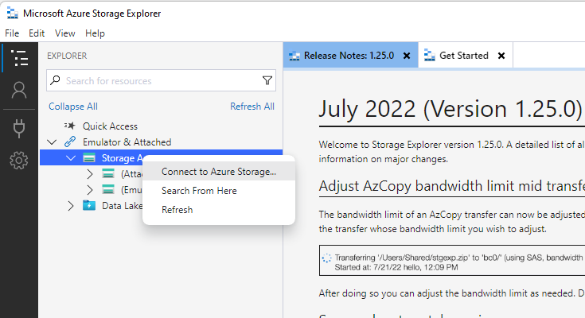
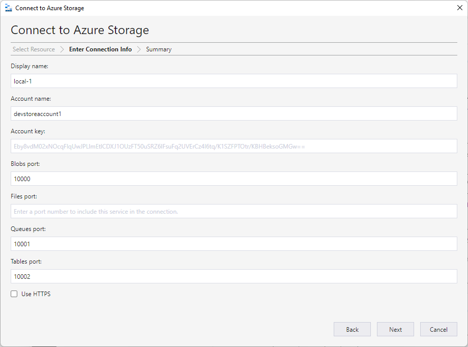
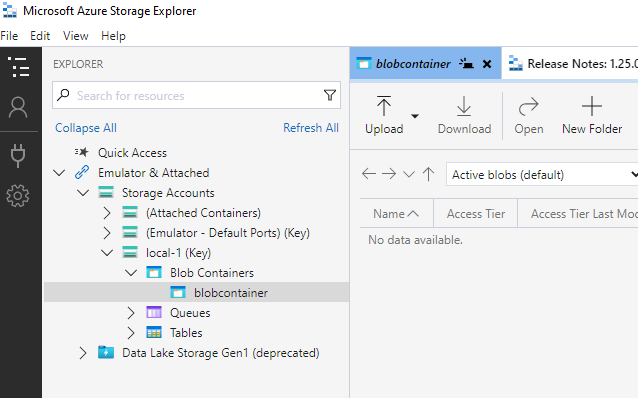

# Using Spring Native with Spring Cloud Azure Storage Blob Starter

This code sample demonstrates how to read and write files with the [Spring Resource](https://docs.spring.io/spring-framework/docs/current/reference/html/core.html#resources) abstraction for Azure Storage using the Spring Cloud Azure storage starter, and build the native executable with Spring Native.

## What You Will Build

You will build an application that use Spring Resource abstraction to read and write data with [Azure Storage Blob](https://azure.microsoft.com/services/storage/blobs/).

## What You Need

- [An Azure subscription](https://azure.microsoft.com/free/)
- [Terraform](https://www.terraform.io/)
- [Azure CLI](https://docs.microsoft.com/cli/azure/install-azure-cli)

- [Docker](https://docs.docker.com/installation/#installation) for [Buildpacks](https://docs.spring.io/spring-native/docs/0.11.4/reference/htmlsingle/#getting-started-buildpacks-system-requirements) usage
- [Native Image](https://www.graalvm.org/22.0/reference-manual/native-image/) for [Native Build Tools](https://docs.spring.io/spring-native/docs/0.11.4/reference/htmlsingle/#getting-started-native-image-system-requirements) usage

  [GraalVM 22.0.0 - Java 11](https://www.graalvm.org/downloads/)

  Windows version link: https://github.com/graalvm/graalvm-ce-builds/releases/download/vm-22.0.0.2/graalvm-ce-java11-windows-amd64-22.0.0.2.zip

- Maven
- You can also import the code straight into your IDE:
    - [IntelliJ IDEA](https://www.jetbrains.com/idea/download)

### Setup Azure Storage Emulator

1. Starter the docker service.
2. Run the command to start the Azurite with Docker:

```shell
docker run -p 10000:10000 mcr.microsoft.com/azure-storage/azurite azurite-blob --blobHost 0.0.0.0
```

3. Download [Azure Storage Explorer](https://azure.microsoft.com/products/storage/storage-explorer/#overview) and install.
4. Configure Azure Storage Explorer:
    1. Connect to Azure Storage.
       
    2. Configure authentication, select *Local storage emulator*, and use these default values;
       
    3. Select *Next*  and *Connect* to finish the configuration, then create a container `blobcontainer` for testing.
       

## Run Locally

### Run the sample based on Spring Native

There are two main ways to build a Spring Boot native application.

#### Run with Buildpacks

- System Requirements

Docker should be installed, see [System Requirements](https://docs.spring.io/spring-native/docs/0.11.4/reference/htmlsingle/#getting-started-buildpacks-system-requirements) for more details.

- Build the native application

Run `mvn -Pbuildpack package spring-boot:build-image`, see [Build the native application](https://docs.spring.io/spring-native/docs/0.11.4/reference/htmlsingle/#_build_the_native_application) for more details.

```shell
mvn -Pbuildpack package spring-boot:build-image
```

- Run the native application

Run `docker run --rm -p 8080:8080 issue-azure-storage-native:0.0.1-SNAPSHOT`, see [Run the native application](https://docs.spring.io/spring-native/docs/0.11.4/reference/htmlsingle/#_run_the_native_application) for more details.
```shell
docker run --rm -p 8080:8080 issue-azure-storage-native:0.0.1-SNAPSHOT
```

#### Run with Native Build Tools

- System Requirements

GraalVM `native-image` compiler should be installed, see [System Requirements](https://docs.spring.io/spring-native/docs/0.11.4/reference/htmlsingle/#getting-started-native-image-system-requirements) for more details. If using the Windows platform, you need to install `Visual Studio Build Tools`, please use VS BuildTools 16.9.

- Build the native application

Run `mvn -Pnative -DskipTests package` command using `x64 Native Tools Command Prompt`, see [Build the native application](https://docs.spring.io/spring-native/docs/0.11.4/reference/htmlsingle/#_build_the_native_application_2) for more details.

```shell
mvn -Pnative -DskipTests package
```

This step will encounter the following exception:
```text
java.lang.SecurityException: class "com.azure.spring.cloud.autoconfigure.compatibility.ContextBootstrapInitializer"'s signer information does not match signer information of other classes in the same package
```

If the build is successful, continue with the following content.

- Run the native application

Run `target\issue-azure-storage-native`, see [Run the native application](https://docs.spring.io/spring-native/docs/0.11.4/reference/htmlsingle/#_run_the_native_application_2) for more details.
```shell
target\issue-azure-storage-native
```

## Verify This Sample

1. Check out the following console log:

   ```text
   StorageApplication data initialization begin ...
   Write data to container=blobcontainer, filePath=azure-blob://blobcontainer/fileName-*.txt
   Downloaded data from the azure storage blob resource: data-*
   Get the data content through this address 'curl -XGET http://localhost:8080/blob/fileName-*.txt'.
   StorageApplication data initialization end ...
   ```
   
2. [Optional] Write and read a file.  
    2.1 Send a POST request to update file contents.

    ```shell
    curl http://localhost:8080/blob/file1.txt -d "new message" -H "Content-Type: text/plain"
    ```
   
    2.2 Verify by sending a GET request.  
    ```shell
    curl -XGET http://localhost:8080/blob/file1.txt
    ```

3. [Optional] Using AzureStorageBlobProtocolResolver to get Azure Storage Blob resources with file pattern.
    ```shell
    curl -XGET http://localhost:8080/blob
    ```
    
    Verify in app's log that a similar messages was posted:
    ```shell
    1 resources founded with pattern:*.txt
    ```


## Clean Up Resources
After running the sample, if you don't want to run the sample, remember to destroy the Azure resources you created to avoid unnecessary billing.

The terraform destroy command terminates resources managed by your Terraform project.   
To destroy the resources you created.

#### Run with Bash

```shell
terraform -chdir=./terraform destroy -auto-approve
```

#### Run with Native Tools Command Prompt

```shell
terraform -chdir=terraform destroy -auto-approve
```
